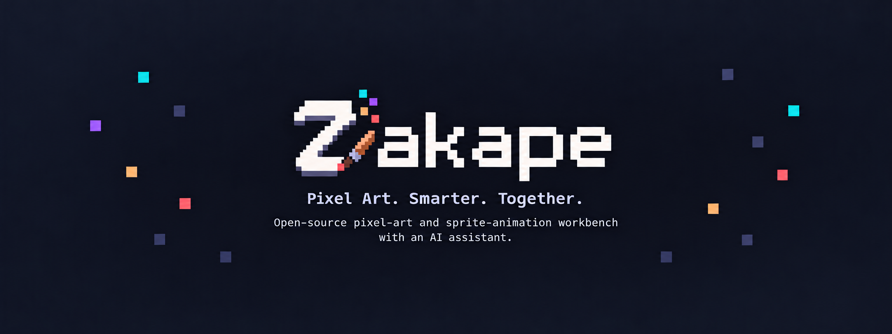

# Zakape

> A local-first pixel studio for drawing, animating, and shipping sprites, with an optional assistant that works under the artist's direction.

## Summary

Zakape is an open-source pixel-art and sprite-animation studio for desktop, Android phones, and tablets. It combines precise drawing tools, independent layers, a frame timeline, onion skinning, palette workflows, selections, and production-ready exports in one focused workspace.

## Description

Create sprites frame by frame, preview motion as you work, and export PNG, GIF, sprite-sheet metadata, or a portable `.zakape` project. Guest access works offline, with optional Google login in desktop builds. When repetitive cleanup or a controlled variation would help, connect local Ollama or a compatible model endpoint. Assistant proposals stay scoped, reviewable, and reversible; drawing and animation remain fully usable without AI.

## Project status

Zakape is in early alpha. The current milestone focuses on a reliable editor loop and a safe, local-first assisted workflow. Project files use the open JSON-based `.zakape` format.

## Quick start

Zakape uses a pnpm workspace with Nuxt applications and a Tauri 2/Rust native shell. Prerequisites are the Node.js and Rust versions pinned by `.node-version` and `rust-toolchain.toml`, pnpm 10.17.1, and the [Tauri 2 platform prerequisites](https://v2.tauri.app/start/prerequisites/).

```bash
pnpm install
pnpm dev
```

Useful commands:

```bash
pnpm dev:site       # public website
pnpm check          # lint, type checks, and tests
pnpm test:e2e       # studio interaction and snapshot tests
pnpm build          # static web builds
pnpm build:desktop  # native Tauri bundle
pnpm build:android:debug   # ARM64 debug APK
pnpm build:android:fdroid  # unsigned release APK for F-Droid signing
pnpm build:android:bundle  # signed Play bundle when a keystore is configured
```

## Development guide

The editor and website use Nuxt, Vue, Tailwind CSS, and Lucide icons. Tauri 2 and Rust provide the desktop/mobile shell and native commands; PGlite provides local persistence. The workspace also uses Vitest and Playwright for behavior and visual regression coverage.

Start with the comprehensive [agent and contributor guide](AGENT.md), then read the [architecture](docs/architecture.md) and [contribution guide](CONTRIBUTING.md). The [project workspace](docs/project-workspace.md), [brand guide](docs/brand.md), [Android build guide](docs/android.md), [desktop Google-login guide](docs/google-login.md), [F-Droid notes](docs/fdroid.md), [model assistant guide](docs/ai/model-assistant.md), [privacy policy](docs/privacy.md), and [release process](docs/release.md) cover their respective workflows.

## Repository map

```text
apps/studio/        Editor application and native packaging
apps/site/          Public project website
assets/brand/       Canonical source artwork, curated banner, and icon manifest
docs/               Architecture, AI, release, and QA notes
.github/             CI, release, Pages, and contribution workflows
```

## Principles

- The pixel editor remains complete and usable without any AI connection.
- Your model credentials stay on your device and are never committed.
- Model output is parsed into a small, validated edit language and previewed before application.
- Exports are ordinary files: PNG, sprite-sheet PNG + JSON, GIF, and `.zakape` project JSON.
- Visual quality and keyboard accessibility are tested as product behavior, not treated as polish debt.

## License

[MIT](LICENSE).
